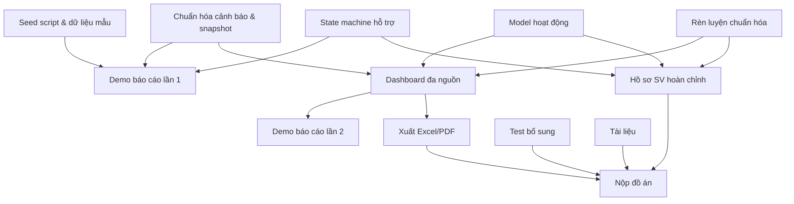

# Kế hoạch hoàn thiện dự án SEWS

**Ngày lập:** 10/09/2026  
**Căn cứ:** [ARCHITECTURE.md](ARCHITECTURE.md), mã nguồn hiện tại và lộ trình S1 (Mục 13.1)  
**Phạm vi:** Hoàn thiện đồ án chuyên ngành — không bao gồm ML (Mục 9) và NCKH (Mục 13.2)

---

## 1. Tổng quan hiện trạng

### 1.1 Đã hoàn thành ✅

| Module | Chi tiết |
| --- | --- |
| **Kiến trúc** | npm monorepo, 2 Next.js app (frontend :3000, backend :3001), PostgreSQL/Prisma |
| **Schema** | 863 dòng Prisma, đầy đủ model học vụ, CTĐT, tiến độ, cảnh báo, hỗ trợ, RBAC |
| **Auth & RBAC** | JWT + HttpOnly cookie, refresh token, scope (`system`/`all_students`/`faculty`/`assigned_classes`), role/permission động, `ClassAdvisorAssignment`, rate limit login |
| **API** | 93 route / 142 phương thức tại `/api/v1` bao phủ hồ sơ, điểm, CTĐT, tiến độ, cảnh báo, dashboard, báo cáo, RBAC |
| **Nhập dữ liệu** | Script import (`import-apidog-data.cjs`), `GradeImportBatch`, `UnscopedGradeRecord`, truy vết `sourcePayload`/`sourceMd5` |
| **Tiến độ CTĐT** | `evaluateProgress()` — đối chiếu đăng ký; `evaluateCompletionPlan()` — đánh giá hoàn thành; kế hoạch phiên bản, snapshot, hash |
| **Cảnh báo theo run** | 5 mã nguyên nhân, chính sách GPA, run/phiên bản, Xanh/Vàng/Đỏ |
| **Báo cáo cảnh báo live** | Tính từ GPA/quyết định của kỳ gần nhất đủ độ phủ; hiện HK2 2025–2026 được chọn vì HK1 2026–2027 đang giữa kỳ và thiếu dữ liệu |
| **Hỗ trợ** | `WarningAction` đọc/tạo cơ bản (GET/POST), chưa có cập nhật/xóa |
| **Frontend** | Dashboard, danh sách SV, chi tiết SV, cảnh báo, tiến độ, báo cáo, RBAC, upload, settings, graduation forecast |
| **Test** | API contract, auth/cookie/Origin, logic quyền, nhập điểm, đăng ký, hoàn thành, cảnh báo |

### 1.2 Cần hoàn thiện ⚠️

| Khoảng trống | Tham chiếu kiến trúc |
| --- | --- |
| Rèn luyện chỉ có `StudentConductRecord` đọc tổng hợp, chưa có tiêu chí theo dõi | Mục 8, 1.3 |
| Hoạt động chưa có model nghiệp vụ (`Activity`, `ActivityParticipation`) | Mục 8, 1.3 |
| Nhật ký hỗ trợ thiếu state machine, thời hạn, phân công, lịch sử | Mục 10 |
| Chưa có XLSX/PDF thật — giao diện báo cáo mới xuất CSV phía client, một số endpoint `export` trả JSON | Mục 10, 1.3 |
| Dashboard đang ghép cảnh báo live với tiến độ theo run; kỳ/cutoff chưa thống nhất cho mọi khối dữ liệu | Mục 7, 10 |
| Báo cáo live còn fallback ngưỡng GPA 2,0 trong mã khi chưa có policy active | Mục 7 |
| Cảnh báo thiếu snapshot đầu vào, `sourceId` cho GPA reason | Mục 7 |
| Tự chọn "chọn N trong M" chưa tổng quát | Mục 6.3 |
| Seed tài khoản/dữ liệu mẫu chưa có | Mục 12 |
| Test coverage mỏng ở edge case (học lại, biên ngưỡng, forecast) | Mục 12 |

---

## 2. Phân pha theo lộ trình S1

### Giai đoạn 1 — Chuẩn hóa nền tảng (10/09 → 20/09/2026)

> **Đích: Báo cáo tiến độ lần 1 trong mốc chính thức 14/09 → 20/09; công việc chuẩn bị bắt đầu từ 10/09**

#### 1.1 Chuẩn hóa dữ liệu và cảnh báo

- [ ] **Bổ sung snapshot đầu vào cho `AcademicWarningRun`**: lưu đầy đủ dữ liệu đầu vào (GPA, tổng hợp kỳ, đợt tiến độ/hoàn thành) để tái hiện lịch sử
- [ ] **Thêm `sourceId` cho reason GPA**: liên kết `LOW_TERM_GPA` và `LOW_CUMULATIVE_GPA` với `StudentTermSummary`/`StudentCumulativeSummary` cụ thể
- [x] **Xử lý kỳ báo cáo thiếu dữ liệu**: báo cáo chọn kỳ gần nhất đạt độ phủ GPA học kỳ 80%; HK1 2026–2027 đang giữa kỳ không thay thế HK2 2025–2026 trong thống kê
- [x] **Tách thiếu dữ liệu khỏi không có cảnh báo trên báo cáo**: Xám = chưa đủ dữ liệu kỳ, Xanh = đủ dữ liệu và không có cảnh báo theo điều kiện hiện tại
- [ ] **Chuẩn hóa ngưỡng báo cáo**: bỏ fallback 2,0 viết trong `reports.ts`, hoặc đưa fallback thành policy mặc định có phiên bản, người kích hoạt và audit
- [ ] **Ghi rõ/hợp nhất hai chế độ**: báo cáo live dùng GPA/quyết định; cảnh báo theo run dùng đủ 5 nguyên nhân. Dashboard hiện dùng live cho cảnh báo và run cho đăng ký/tiến độ
- [ ] **Thống nhất bộ lọc dashboard**: mỗi khối phải dùng kỳ đã chọn hoặc hiển thị rõ kỳ/cutoff thực tế của nguồn dữ liệu

#### 1.2 Hoàn thiện nhật ký hỗ trợ (`WarningAction`)

- [ ] **State machine backend**: `OPEN → IN_PROGRESS → RESOLVED`, thêm `ESCALATED` và `REOPENED`; kiểm soát chuyển trạng thái hợp lệ
- [ ] **Mở rộng model**: thêm `assignedUserId`, `dueDate`, `resolvedAt`, `statusHistory` (JSON hoặc bảng phụ)
- [ ] **Quyền ghi riêng**: tách `academic_warning.action.create` / `.update` khỏi `academic_warning.read`
- [ ] **API cập nhật**: PUT/PATCH cho chuyển trạng thái, validate điều kiện, ghi audit log

#### 1.3 Seed script và dữ liệu mẫu

- [ ] **Tạo seed script**: tài khoản admin mặc định, role/permission cơ bản, dữ liệu mẫu đủ để demo
- [ ] **Cập nhật README**: hướng dẫn chạy seed khi triển khai mới

**Sản phẩm giao nộp:** Tài liệu tiến độ lần 1, demo hệ thống với cảnh báo chuẩn hóa, nhật ký hỗ trợ có state machine

---

### Giai đoạn 2 — Rèn luyện, hoạt động, dashboard đa nguồn (21/09 → 11/10/2026)

> **Mục tiêu: Luồng nhập → tính → hiển thị hoàn chỉnh; Báo cáo lần 2 (12–18/10)**

#### 2.1 Rèn luyện

- [ ] **Chuẩn hóa `StudentConductRecord`**: ánh xạ `statusId` sang trạng thái phê duyệt rõ ràng, xác định điểm nào là điểm công nhận (`lastScore` hay trường khác)
- [ ] **Phân loại theo S5**: 90–100 Xuất sắc, 80–89 Tốt, 65–79 Khá, 50–64 TB, 35–49 Yếu, <35 Kém
- [ ] **API bổ sung**: endpoint riêng cho rèn luyện sinh viên (GET danh sách, GET chi tiết theo kỳ)
- [ ] **Tích hợp cảnh báo**: thêm reason code `LOW_CONDUCT_SCORE` khi điểm rèn luyện dưới ngưỡng theo dõi (cấu hình trong policy)
- [ ] **Frontend**: hiển thị điểm rèn luyện trong hồ sơ sinh viên và dashboard

#### 2.2 Hoạt động (tối thiểu khả thi)

- [ ] **Model mới**: `Activity` và `ActivityParticipation` theo đề xuất Mục 8
  ```
  Activity: id, sourceCode, name, type, organizingUnit, semester, 
            targetAudience, startDate, endDate
  ActivityParticipation: id, studentId, activityId, status (registered/
            attended/completed), evidence, verifiedBy, verifiedAt
  ```
- [ ] **Migration Prisma**: tạo bảng, index, FK
- [ ] **API CRUD**: GET/POST/PUT cho Activity; GET/POST cho Participation (ghi nhận, xác nhận)
- [ ] **Chống trùng**: kiểm tra trùng đăng ký/tham dự theo `studentId + activityId`
- [ ] **Frontend**: trang danh sách hoạt động, ghi nhận tham gia, bộ lọc theo kỳ/loại

#### 2.3 Dashboard nâng cao

- [ ] **Tổng hợp đa nguồn**: dashboard hiển thị cảnh báo, rèn luyện, hoạt động song song
- [ ] **Bộ lọc nâng cao**: theo kỳ, khóa, CTĐT, mức cảnh báo, trạng thái hỗ trợ
- [x] **Báo cáo cảnh báo hiện tại**: có phân bố Đỏ/Vàng/Xanh/Xám, xu hướng cảnh báo theo kỳ, thống kê theo lớp và drill-down danh sách
- [ ] **Biểu đồ còn thiếu**: xu hướng GPA nhiều kỳ và phân bố rèn luyện; biểu đồ GPA trên dashboard hiện chưa tạo thành chuỗi lịch sử nhiều kỳ
- [ ] **Chỉ số thiếu dữ liệu đa nguồn**: báo cáo đã có số SV thiếu GPA kỳ; còn thiếu chỉ số dữ liệu rèn luyện và hoạt động

**Sản phẩm giao nộp:** Báo cáo lần 2, demo luồng nhập → tính → hiển thị đa nguồn

---

### Giai đoạn 3 — Hồ sơ, xuất dữ liệu, test, tài liệu (19/10 → 15/11/2026)

> **Mục tiêu: Hoàn thiện sản phẩm, nộp đồ án (16–22/11)**

#### 3.1 Xuất Excel/PDF

- [x] **Mức tạm thời hiện có**: trang báo cáo tải toàn bộ danh sách và tạo CSV phía trình duyệt; chưa phải workbook Excel
- [ ] **Excel**: dùng thư viện (ExcelJS hoặc SheetJS) tạo file .xlsx
  - Danh sách sinh viên cảnh báo theo kỳ/khóa/CTĐT
  - Bảng tổng hợp tiến độ CTĐT
  - Báo cáo rèn luyện
  - Nhật ký hỗ trợ
- [ ] **PDF**: dùng thư viện (pdfkit hoặc puppeteer) tạo báo cáo
  - Hồ sơ chi tiết sinh viên (học tập + rèn luyện + cảnh báo)
  - Báo cáo tổng hợp cho ban chủ nhiệm khoa
- [ ] **API endpoint**: GET `/reports/export` với query `format=xlsx|pdf`, `type=warnings|progress|conduct`
- [ ] **Frontend**: nút xuất trên các trang báo cáo, loading state khi tạo file

#### 3.2 Hoàn thiện hồ sơ sinh viên

- [ ] **Trang chi tiết đầy đủ**: hiện đã có học tập, điểm rèn luyện tổng hợp, quyết định, cảnh báo và nhật ký hỗ trợ; cần tách/chuẩn hóa tab Rèn luyện, thêm Hoạt động và hoàn thiện liên kết dữ liệu giữa các phần
- [ ] **Timeline lịch sử hợp nhất**: hiện có danh sách lịch sử cảnh báo và nhật ký hỗ trợ riêng; cần ghép cảnh báo, quyết định và hành động hỗ trợ theo kỳ/thời điểm
- [ ] **In hồ sơ**: xuất PDF hồ sơ sinh viên đầy đủ

#### 3.3 Kiểm thử bổ sung

- [ ] **Edge case nhập dữ liệu**: nhập lặp, trùng mã, thiếu kỳ, sai số, hai CTĐT
- [ ] **Edge case điểm/CTĐT**: học lại, chờ điểm, không tính GPA, tự chọn thay thế, tín chỉ ngoài tổng
- [ ] **Edge case tiến độ**: đăng ký nhưng chưa đạt, chưa đến hạn, pending, forecast ≠ standard
- [ ] **Edge case cảnh báo**: biên ngưỡng GPA, nhiều lý do, thiếu GPA ≠ an toàn
- [ ] **Rèn luyện/hoạt động**: trạng thái tạm/công nhận, trùng minh chứng, kỳ hè
- [ ] **Hỗ trợ/quyền**: ngoài lớp/khoa, đọc/ghi/xuất, chuyển trạng thái
- [ ] **Báo cáo**: cùng run/scope cùng kết quả, đếm SV (không đếm lý do)

#### 3.4 Chuẩn hóa kỹ thuật

- [ ] **Sửa lint frontend**: xử lý lỗi lint còn tồn đọng
- [ ] **Chuẩn hóa API response**: thống nhất envelope nếu cần, error code, pagination
- [ ] **Audit log**: kiểm tra mọi thao tác nhạy cảm (ghi hỗ trợ, đổi quyền, xóa dữ liệu) được ghi log
- [ ] **Smoke test mở rộng**: bổ sung test cho rèn luyện, hoạt động, xuất file

#### 3.5 Tài liệu

- [ ] **Cập nhật README**: hướng dẫn mới (seed, export, rèn luyện, hoạt động)
- [ ] **Tài liệu API**: cập nhật `api-operations.json` với endpoint mới
- [ ] **Hướng dẫn sử dụng**: tài liệu cho người dùng cuối (cán bộ quản lý, CVHT)
- [ ] **Cập nhật ARCHITECTURE.md**: phản ánh thay đổi schema, API, nghiệp vụ mới

**Sản phẩm giao nộp:** Nộp báo cáo đồ án (16–22/11/2026)

---

## 3. Chi tiết kỹ thuật

### 3.1 Schema mới cần tạo (Prisma migration)

```prisma
// Hoạt động
model Activity {
  id               String    @id @default(dbgenerated("gen_random_uuid()")) @db.Uuid
  sourceCode       String    @unique @map("source_code") @db.VarChar(64)
  name             String    @db.VarChar(500)
  type             String    @db.VarChar(128)     // Chính trị, XH, VH, TT, ...
  organizingUnit   String?   @map("organizing_unit") @db.VarChar(255)
  academicTermId   String?   @map("academic_term_id") @db.Uuid
  conductTermId    String?   @map("conduct_term_id") @db.Uuid  // kỳ tính rèn luyện
  startDate        DateTime? @map("start_date") @db.Date
  endDate          DateTime? @map("end_date") @db.Date
  targetAudience   String?   @map("target_audience") @db.VarChar(255)
  description      String?
  sourcePayload    Json?     @map("source_payload")
  createdAt        DateTime  @default(now()) @map("created_at") @db.Timestamptz(6)
  updatedAt        DateTime  @default(now()) @updatedAt @map("updated_at") @db.Timestamptz(6)
  
  participations   ActivityParticipation[]
  @@index([academicTermId, type], map: "activities_term_type_idx")
  @@index([conductTermId], map: "activities_conduct_term_idx")
  @@map("activities")
}

model ActivityParticipation {
  id             String    @id @default(dbgenerated("gen_random_uuid()")) @db.Uuid
  studentId      String    @map("student_id") @db.Uuid
  activityId     String    @map("activity_id") @db.Uuid
  status         String    @default("registered") @db.VarChar(32)
  evidence       String?   @db.VarChar(500)
  verifiedBy     String?   @map("verified_by") @db.Uuid
  verifiedAt     DateTime? @map("verified_at") @db.Timestamptz(6)
  notes          String?
  sourcePayload  Json?     @map("source_payload")
  createdAt      DateTime  @default(now()) @map("created_at") @db.Timestamptz(6)
  updatedAt      DateTime  @default(now()) @updatedAt @map("updated_at") @db.Timestamptz(6)

  activity       Activity  @relation(fields: [activityId], references: [id])
  @@unique([studentId, activityId], map: "participation_student_activity_unique")
  @@index([studentId, status], map: "activity_participations_student_status_idx")
  @@index([activityId, status], map: "activity_participations_activity_status_idx")
  @@index([verifiedBy], map: "activity_participations_verified_by_idx")
  @@map("activity_participations")
}
```

Đoạn trên là phác thảo trường và index, chưa phải schema copy-paste hoàn chỉnh. Migration phải tạo và kiểm tra FK cho `academicTermId`, `conductTermId`, `studentId`, `activityId`, `verifiedBy`; nếu biểu diễn bằng Prisma relation thì đồng thời bổ sung các trường relation ngược ở `AcademicTerm`, `Student` và `User`. Cần chốt `onDelete` trước khi tạo migration để không xóa dây chuyền lịch sử tham gia.

### 3.2 Mở rộng WarningAction

```prisma
// Thêm trường vào model WarningAction hiện có
model WarningAction {
  // ... trường hiện có ...
  actorId         String?   @map("actor_id") @db.Uuid
  assignedUserId  String?   @map("assigned_user_id") @db.Uuid
  dueDate         DateTime? @map("due_date") @db.Date
  resolvedAt      DateTime? @map("resolved_at") @db.Timestamptz(6)
  statusHistory   Json      @default("[]") @map("status_history")
}
```

### 3.3 File mới cần tạo

| File | Mục đích |
| --- | --- |
| `apps/backend/lib/services/activities.ts` | Service CRUD hoạt động và tham gia |
| `apps/backend/lib/services/conduct.ts` | Service rèn luyện — phân loại, API riêng |
| `apps/backend/lib/services/export.ts` | Service xuất Excel/PDF |
| `apps/backend/app/api/v1/activities/route.ts` | API hoạt động |
| `apps/backend/app/api/v1/activities/[id]/route.ts` | API chi tiết hoạt động |
| `apps/backend/app/api/v1/activities/[id]/participations/route.ts` | API tham gia hoạt động |
| `apps/backend/app/api/v1/students/[id]/conduct/route.ts` | API rèn luyện sinh viên |
| `apps/backend/app/api/v1/academic-warnings/actions/[id]/route.ts` | API cập nhật trạng thái/phân công hồ sơ hỗ trợ |
| `apps/backend/app/api/v1/reports/export/route.ts` | API xuất báo cáo |
| `apps/backend/prisma/seed.ts` | Seed script |
| `apps/frontend/app/(dashboard)/activities/page.tsx` | Trang hoạt động |

### 3.4 Thư viện cần cài thêm

| Package | Mục đích | Workspace |
| --- | --- | --- |
| `exceljs` | Xuất file .xlsx | backend |
| `pdfkit`, `@react-pdf/renderer` hoặc `puppeteer` (chọn một) | Xuất file PDF | backend |

---

## 4. Ưu tiên và phụ thuộc



---

## 5. Rủi ro và giảm thiểu

| Rủi ro | Mức | Giảm thiểu |
| --- | --- | --- |
| Không có nguồn dữ liệu hoạt động thực | Cao | Tạo giao diện nhập thủ công + import CSV; ghi rõ phạm vi chưa hoàn thành nếu thiếu nguồn, thống nhất GVHD |
| Ngưỡng fallback 2,0 bị hiểu là quy định chính thức | Cao | Hiển thị đây là ngưỡng tạm, kích hoạt policy có phiên bản và lưu policy/cutoff trong báo cáo |
| Điểm rèn luyện chưa xác nhận `statusId` | TB | Ưu tiên tiếp nhận kết quả từ đơn vị; ghi giả định rõ |
| Thời gian eo hẹp cho xuất PDF phức tạp | TB | Ưu tiên Excel trước, PDF cơ bản; PDF nâng cao nếu còn thời gian |
| Edge case CTĐT phức tạp (tự chọn N/M) | TB | Ghi nhận giới hạn, test với CTĐT K44 hiện có |
| Lint error tồn đọng frontend | Thấp | Sửa dần, không tắt rule |

---

## 6. Tiêu chí hoàn thành đồ án

- [ ] Hồ sơ sinh viên đầy đủ (học tập + rèn luyện + hoạt động + cảnh báo + hỗ trợ)
- [ ] Dữ liệu điểm/đăng ký/quyết định nhập và truy xuất được
- [ ] Kế hoạch và tiến độ CTĐT đánh giá chính xác
- [ ] Cảnh báo theo quy tắc với đầy đủ nguyên nhân, snapshot, truy vết nguồn
- [ ] Nhật ký hỗ trợ có state machine và phân công
- [ ] Phân quyền đúng theo vai trò và phạm vi dữ liệu
- [ ] Dashboard tổng hợp đa nguồn với bộ lọc
- [ ] Báo cáo xuất Excel/PDF
- [ ] Test bao phủ edge case chính
- [ ] Tài liệu cập nhật (README, ARCHITECTURE, hướng dẫn sử dụng)

---

## 7. Ghi chú quan trọng

> [!IMPORTANT]
> **ML (Mục 9) và NCKH (Mục 13.2)** hoãn sang giai đoạn sau, không nằm trong phạm vi đồ án này.

> [!WARNING]
> Mức cảnh báo nội bộ (Xanh/Vàng/Đỏ) là chỉ số theo dõi, **không** tương đương mức kỷ luật chính thức của trường. Hệ thống hỗ trợ ra quyết định, không thay quyết định nhà trường.

> [!NOTE]
> Kế hoạch này cần được điều chỉnh theo phản hồi GVHD và tình hình dữ liệu thực tế. Nếu không có nguồn hoạt động từ đơn vị, ghi rõ yêu cầu chưa hoàn thành hoặc điều chỉnh phạm vi đã thống nhất.
